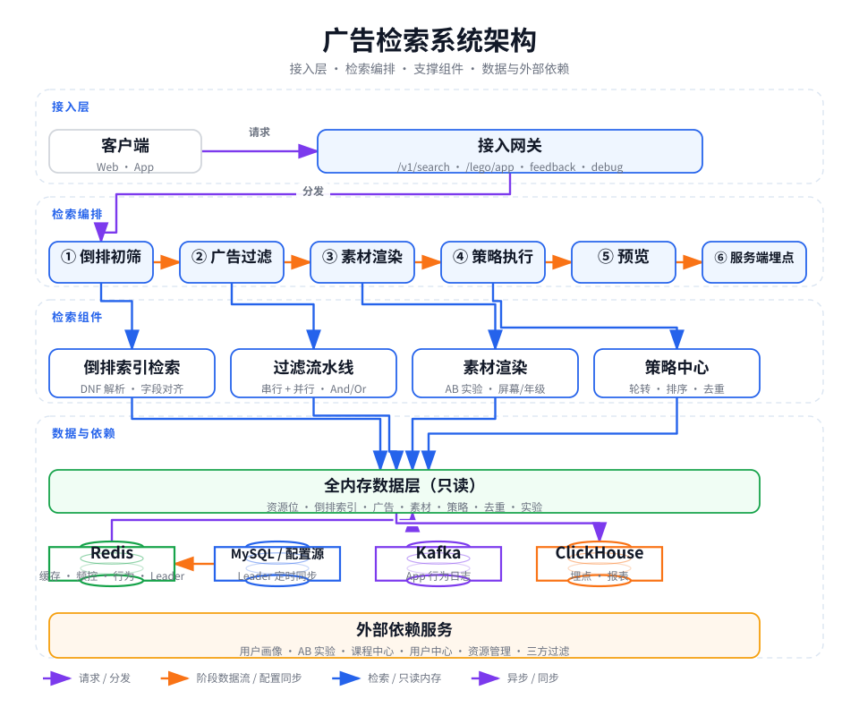

做广告检索，第一反应通常是"上 ES"，或者"接一个特征平台"。但把场景收窄之后，结论可能相反：

- 单个资源位的候选广告只有**几十到几百条**；
- 配置变更**低频**（运营在后台点几下），检索**高频**（用户每次进页面都触发）；
- 允许**分钟级最终一致**，不需要强一致。

在这三条约束下，"全内存 + 倒排索引 + 定时同步"比引入一个独立集群更简单、更可控，链路也更短。adengine 就是这样一套系统：它面向教育业务 App、Web、小程序的大量广告资源位（开屏、弹窗、二楼、课程详情横幅、首页整屏），把"哪些广告、在什么条件下、展示给哪些人"变成运营可配置的规则，并在服务端完成检索、过滤、素材渲染、策略执行与埋点。

本文按"边界 → 架构 → 倒排索引 → 流水线 → 数据层 → 频控 → 行为与轮转 → 埋点 → 稳定性 → 问题清单"的顺序拆解它的实现，重点放在**源码级的设计取舍与坑**：尽量用流程图与结构图把机制讲清楚，只在关键缺陷处保留少量代码，也会指出读码过程中发现的、可以改进的地方。

## 一、问题与边界

这类系统的设计空间，几乎完全由三个数字决定：**候选集有多大、变更有多频繁、一致性要求有多弱**。

| 约束 | 实际取值 | 推出的结论 |
|---|---|---|
| 读多写极少 | 运营改动低频、检索每次进页面触发 | 数据全量常驻内存，检索路径不碰 DB |
| 候选集小 | 单资源位广告数几十~几百 | 不需要 ES，普通 map 倒排足够 |
| 一致性弱 | 运营改动秒~分钟级生效即可 | 三级缓存 + 定时同步，不上分布式锁 |
| 外部依赖多 | 画像、活动、实验、用户中心、三方过滤 | 全部 fail-open，故障不拖垮主链路 |

"候选集小"是最容易被忽略的一条。业界谈广告检索，默认语境是全网级广告库（百万到亿级），所以倒排索引 + 位图 + 分片是标配。但当候选集只有几百条时，一次检索的全部成本可能还不如一次 Redis 往返——真正的瓶颈在**外部依赖的串行调用**上，而不是在索引结构上。

这套系统的主链路延迟优化，几乎都围绕这一点展开（见第四节的并行组）。

### 为什么不是 Elasticsearch

| 维度 | 内存 map 倒排（本系统） | Elasticsearch |
|---|---|---|
| 候选集规模 | 单资源位几十~几百 | 全网级 |
| 查询延迟 | 纯内存，微秒级 | 毫秒级（段 + 缓存） |
| 运维成本 | 无独立集群，随应用发布 | 独立集群、分片、副本 |
| 内存占用 | 键值 map，指针密度高 | 依赖段合并与缓存策略 |
| 一致性 | 定时同步，最终一致 | 近实时刷新 |

结论：在"每个资源位广告量小、资源位数量固定、读路径要求微秒级"的约束下，map 倒排是最简单正确的选择。演进路径也留好了：若某个资源位的广告量涨到上万，把索引值集合从哈希集换成分块位图即可（代码里已经有位图实现，见 3.6）。

## 二、整体架构



分层职责划分得很清楚：

| 层 | 职责 | 关键点 |
|---|---|---|
| 接入层 | HTTP 接口：检索、反馈、支付回调、调试 | 统一中间件：Trace 透传 → panic 兜底 → 响应耗时统计 |
| 检索编排 | 六阶段流水线 | 数据流始终是"资源位 → 数据"的映射结构 |
| 支撑组件 | 倒排索引、过滤流水线、素材渲染、策略中心 | 各自独立演进，由编排层组合 |
| 数据与依赖 | 全内存只读数据 + Redis/MySQL/Kafka/ClickHouse | 检索只读内存，外部调用全部 fail-open |

编排层是全篇的主线，它本身就是一段六步式流水线：


flowchart LR
    Q(["请求：资源位 + 用户属性"]) --> S1["① 倒排初筛<br/>ID 级"]
    S1 --> S2["② 广告过滤<br/>ID 级"]
    S2 --> S3["③ 素材渲染<br/>对象级"]
    S3 --> S4["④ 策略执行<br/>对象级"]
    S4 --> S5["⑤ 预览<br/>独立数据通路"]
    S5 --> S6["⑥ 服务端埋点<br/>异步投递"]
    S6 --> R(["响应：广告 + 埋点数据"])


六个阶段，每一步都有明确的数据形态。这个"形态渐进"是刻意设计的：

| 阶段 | 数据结构 | 数量级 | 说明 |
|---|---|---|---|
| ① 倒排初筛 | 广告 ID 字符串切片 | < 100 | 只操作 ID，不加载对象 |
| ② 广告过滤 | 广告 ID 字符串切片 | 收敛 | 时间/版本/频控/画像逐层裁剪 |
| ③ 素材化 | 广告对象（含素材组） | ≤ 候选数 | 此时才物化为对象 |
| ④ 策略与限量 | 广告对象 | ≤ 资源位上限 | 最终裁剪 |
| ⑤ 预览 | 广告对象 | 同线上 | 独立数据通路 |
| ⑥ 埋点 | 广告对象 | 同响应 | 异步投递，主链路零开销 |

**为什么阶段 ② 只传 ID 不传对象**：过滤阶段的逻辑几乎都只需要判断"这个广告要不要"，而不需要读它的素材内容。传 ID 意味着裁剪阶段的容器里装的是字符串切片，体积小、GC 压力低；只有确定要展示的广告才在阶段 ③ 被物化成对象。如果反过来，让对象从头流到尾，几轮过滤下来会制造大量"生成了又被丢弃"的临时对象。

有一点需要澄清：**多个资源位在代码里是串行处理的**。`indexer.Multi` 就是一个 `for slotID := range q.SlotIdsFloat()` 的循环，每个资源位依次跑一遍六阶段。资源位之间确实互不影响（各自独立的 key、独立的结果），但并没有并行——真正的并行发生在**单个资源位内部的过滤环节之间**（见第四节）。一次首页整屏请求带十几个资源位时，这里是可观的优化空间。

## 三、倒排索引：把投放表达式编译成可检索结构

### 3.1 投放条件就是一条 DNF 表达式

运营为每个广告配置的"投放条件"，本质是一个析取范式字符串：


flowchart TB
    E["一条 DNF 表达式<br/>adpid ~ 12970,1594,787<br/>^ adsite !~ 1<br/>^ client ~ pc<br/>^ gender ~ 488,560"]
    E --> G1["条件组 1：adpid 属于三个值之一"]
    E --> G2["条件组 2：adsite 不属于 1"]
    E --> G3["条件组 3：client 为 pc"]
    E --> G4["条件组 4：gender 属于两个值之一"]
    G1 --> AND{"组间用 ^ 连接 = AND<br/>组内用逗号分隔 = OR"}
    G2 --> AND
    G3 --> AND
    G4 --> AND


- `字段 ~ {v1,v2}`：属于集合，**OR** 语义，命中任一值即可；
- `字段 !~ {v}`：不属于集合；
- `^` 连接：**AND** 语义，全部满足才命中。

这个 DSL 很小，但它把"投放规则"从代码里完全挪到了配置里。检索侧只需要理解"集合包含关系"，不需要理解任何具体业务字段的含义——这是新增投放维度不需要改代码的前提。

### 3.2 写路径：`字段_值` 两级索引 + 三个伴生结构

解析器按 `^` 切分条件组，把每个字段值展开成 `字段_值` 形式的索引键（如 `grade_29`、`area_27`），构建出每个资源位一份的倒排索引：


flowchart LR
    EX["广告投放表达式（DNF）"] --> AN["解析：按 ^ 拆分条件组<br/>展开成 字段_值 索引键"]
    AN --> CM["补默认值<br/>写侧与资源位约束归一化"]
    CM --> I1[("index<br/>字段_值 → 广告 ID 集合")]
    CM --> I2[("adField<br/>广告 → 声明了哪些字段")]
    CM --> I3[("adIDs<br/>资源位 → 全量广告 ID")]


这里同时维护了三个结构，各有用途：

1. `index`：主倒排索引，`字段_值 → 广告集合`，检索用；
2. `adField`：广告 → 声明了哪些字段，用于反向校验（见 3.3）；
3. `adIDs`：资源位下的全量广告 ID，用于同步广告详情时遍历。

**注意 `map[string]string` 而不是 `map[string]bool` 当集合用**：`map[string]struct{}{}` 更省内存，但这里用空字符串做值——在 tens of thousands 量级下差异不大，换来的是 `for id := range values` 的写法更顺手。

解析失败时的策略是"**跳过单条，不阻断全量**"：

解析入口用 `defer + recover` 兜住 panic，失败只记日志并返回空条件——脏配置最多让这条广告少几个索引键（投不出去），不会让整个资源位的索引构建失败。

一条脏配置只会让对应广告少几个索引键（最多是投不出去），不会让整个资源位的索引构建失败。这个取舍在"配置由多个人在多个后台维护"的系统里是必须的——索引构建失败意味着整个资源位没有广告，影响面比单条广告大得多。

### 3.3 读路径：用两个计数器实现集合等价判定

检索算法短得出奇：


flowchart TD
    A["遍历查询的每个字段"] --> B["该字段所有候选值的命中集合求并"]
    B --> C{"并集为空？"}
    C -->|"是"| Z["直接返回空：该字段无人命中"]
    C -->|"否"| D["累计每个广告命中的字段数<br/>计数器 ①"]
    D --> A
    A --> F["逐个广告判定"]
    F --> G{"命中字段数 ≥ 查询字段数<br/>且 广告字段数 == 查询字段数<br/>计数器 ②"}
    G -->|"否"| X["剔除"]
    G -->|"是"| H{"详情已在内存中？"}
    H -->|"否"| X
    H -->|"是"| Y["入选候选"]


这里有一个很漂亮的技巧：**用两个计数器代替集合运算**。

- `hitKeyCount >= reqInvertKeyCount`：广告在查询的**每一个**字段上都出现过，即"查询字段集合 ⊆ 广告字段集合"；
- `adKeyCount == reqKeyCount`：广告声明的字段数等于查询的字段数。

两个条件同时成立，就等价于"**广告字段集合 == 查询字段集合**"（因为一边包含、一边数量相等 ⟹ 集合相等）。不需要任何交并集运算，一轮 map 遍历就完成判定。

为什么要求集合相等，而不是"包含即可"？这是这套系统最容易踩的坑，值得展开。

假设查询条件有 A、B、C 三个字段（对应三组请求参数），而某个广告只声明了 A、B：

- 如果只判断"查询字段 ⊆ 广告字段"，这个广告在查询 A、B 时会命中；
- 但它的语义是"我在 A、B 上有限制，在 C 上没有任何限制"——只要用户请求里的 C 与它无关，它就应该能投；
- 而系统的判断是：**不行**，因为 C 这个维度上广告没有表态，检索器无法区分"不限 C"和"声明漏了 C"。

于是系统选择了严格语义：**广告必须对查询涉及的每个维度都表态**。这带来的运营含义是：

- 广告的 DNF 里必须出现所有"查询侧一定会带的字段"。比如查询侧对 `area` 有默认补全（见 3.4），所以**一个没有声明 `area` 的广告，在任何请求下都不会命中**——从运营视角看，"漏配地区"等价于"这个广告被下线了"，且没有任何报错；
- 反过来，广告声明了查询侧不存在的字段（比如声明了 `gender` 但请求不带），也会因为字段数不等而被剔除——这防止了"配置了限制却不生效"的静默错误。

检索最后还有一道防御：

最后一道防御是逐个确认广告详情已在内存中，不在就剔除（即上图最后一环）。

索引与详情由两个 worker 分别同步，天然存在时间差：索引里已经有某个广告，但广告详情还没拉下来。这道过滤保证了脏数据不会流到后续阶段（同时也不得不承担一次 map 查找的成本）。

### 3.4 写读两侧的默认值对齐：这套系统最需要读懂的一段配置

索引构建和查询构建是**两个独立代码路径**，如果两侧对"字段缺省"的理解不一致，检索结果就会静默错误。系统用四组配置来保证对齐（`config/index.go`）：

| 配置 | 作用侧 | 触发条件 | 补什么值 | 语义 |
|---|---|---|---|---|
| `IndexMustFields` | 写（索引构建） | 广告 DNF 缺该字段 | `subject_0`、`course_id_0`、`tag_buy_68` 与 `tag_buy_5779`、`user_type_0` | 未声明的通用字段视为"不限" |
| `IndexMustFieldsVals` | 写 | 广告 DNF 有该字段 | 额外追加 `user_type_0` | 用户类型取不到时仍按 0 处理 |
| `QueryDefaultFields` | 读（查询构建） | 请求缺该字段 | `area_0`、`subject_0`、`course_id_0`、`user_type_0` | 请求未指定的维度按默认值查 |
| `QueryMustFieldsVals` | 读 | 请求带该字段 | 额外追加 `area_0`、`course_id_0` | 让"声明为 0"的广告在任何取值下都能命中 |

几条规则背后的语义值得逐条品：

**① 登录态同时补两个值。** `tag_buy` 写侧补 `{68, 5779}`（未登录/已登录），意味着"没声明登录态的广告对所有人可见"；查询侧在 `Prepare` 里根据用户是否登录**强制**设置其中一个，于是任何登录态都能命中。这是"补齐"策略。

**② 支持学科的资源位，未声明学科的广告补 `-1`。**

具体做法是：支持学科的资源位下，广告若没有声明 `subject`，索引侧就给它补一个哨兵值 `-1`。

`IndexValMust = "-1"` 是个哨兵值：查询侧的 `subject` 默认值是 `0`，永远不会等于 `-1`，所以这类广告**永远命中不了**。它表达的业务语义是"这个资源位不支持未声明学科的广告"——用"一个永远不匹配的值"来表达"不允许"，而不是加一个专门的校验环节。

**③ `area` 的写读不对称。** 写侧不补 `area`，读侧补 `area_0`；而且读侧还有一个 `QueryMustFieldsVals`：请求带了 `area_X` 时，查询键变成 `[area_X, area_0]`。

这一套组合的效果是：

- 声明 `area ~ {27}` 的广告只在地区 27 命中；
- 声明 `area ~ {0}` 的广告在任何地区都命中（因为查询总会带上 `area_0`）——`area=0` 就是"全国"的表达；
- **不声明 `area` 的广告永远不命中**（如前所述）。

**④ `user_type` 的特殊性。** 用户类型有时来自请求参数，有时要靠接口异步取（见第五节）。所以写侧除了补默认值 `user_type_0`，还在"广告声明了 user_type"时**追加** `user_type_0`——意思是"我限制了用户类型，但当用户类型取不到时，仍按 0 处理，别把我筛掉"。这是对"外部依赖可能失败"的一种提前妥协。

把这一节读完，就会理解这套索引的真正设计意图：**把"广告级约束"与"资源位级约束"在写入索引时归一化成同一种东西（`字段_值` 键），让查询侧完全不需要感知广告的个性化配置**。检索算法因此能保持 O(n) 的简单形态。

### 3.5 预览：独立数据通路

运营在后台配完广告，需要立刻看到效果。这套系统没有为预览写第二条检索链路，而是复用同一套算法、换一份数据：

- 索引与广告详情各有一份**带 `preview_` 前缀的内存副本**（`index_p`、`adFields_p`、`adIDs_p`、`infos_p`）；
- 查询侧用 `config.IndexFieldForPreview` 指定"预览检索只认哪些字段"，其余字段在 `Prepare` 与 `checkFieldMap` 里被对称地删掉/补默认值；
- 素材 ID 被重写为合成 ID（`广告ID_组下标_候选下标_素材下标`），保证预览素材在埋点、日志上与线上完全隔离；
- 命中预览数据后，按"固定位置优先 + 数量上限"与线上结果合并（`preview.merge`），实现"运营预览时精准占位"。

同一套算法跑两份数据，代价是内存翻倍（只对少量预览数据）、以及**所有涉及索引的代码都要多一个 `preview bool` 参数**——翻遍 `Index`、`Prepare`、`Trigger`、`Ad`、`Fields`，几乎每个函数都带这个参数。这是典型的"用一个布尔参数换一条数据通路"的取舍：代码里到处是 `if preview`，但省掉了整套链路复制。

### 3.6 两处与文档不一致的实现细节

读代码时发现两个和技术方案描述不完全一致的地方，值得单独说。

**① `!~`（不属于）条件实际被忽略。**

技术方案里写了 `字段 !~ {v}` 的排除语义，解析器里也确实有对应分支，但这段分支写错了变量：

```go
} else {
	// 不属于的情况
	var resArray []string
	attributes := strings.Split(value, "!~")
	keys := wordRules(attributes[0])

	resArray = strings.Split(attributes[1], ",")
	for key, valu := range resArray {
		tmpVal := AttributeRules(valu)
		if tmpVal == "" { continue }
		resArray[key] = tmpVal          // 结果写进了 resArray
	}

	if len(slic) > 0 {                  // 但判断的是外层 if 分支的 slic
		result[keys] = slic             // slic 在 else 分支里从未被赋值
	}
}
```

`slic` 是在 `for` 循环体内、`if/else` 之前声明的（`var slic []string`），只有"属于"分支会向它 append。到了 `else` 分支，`slic` 恒为 `nil`，`len(slic) > 0` 恒为 false，于是 `result` 里永远不会写入这个字段。

**影响**：运营在 DNF 里写的 `!~` 排除条件被静默丢弃。检索阶段也没有对应的"排除通道"（`Trigger` 只有命中计数，没有负向计数）。如果业务上确实用到了 `!~`，那些广告的实际投放范围会比配置的更大。

**建议**：要么补完实现（在该分支用 `resArray` 写入 result，并在检索侧增加"排除键命中即剔除"的逻辑），要么在解析时显式报错/告警——最怕的是"配置界面上能填、保存成功、但不生效"。

**② 位图（Bitmap）是预留能力，但没有调用方。**

技术方案提到"若未来单资源位广告量上万，可将值集合替换为分块位图"，代码里确实有 `util/helper/bitmap.go` 实现了分块、负向（`NewBitMapNeg`）、排除集合（`SetExclude`）三种能力。但全仓库搜索调用方，只有定义、没有任何使用。

顺带发现这个预留实现里有个会直接 panic 的写法：

```go
func (st *Bitmap) Set(ids ...uint64) *Bitmap {
	if st.withLock {              // 无锁模式跳过加锁
		st.rwlock.Lock()
	}
	for _, id := range ids { /* ... */ }
	st.rwlock.Unlock()            // 但无条件解锁
	return st
}
```

`NewBitMapNoLock()` 和 `NewBitMapNeg()` 创建的实例 `withLock` 都是 false，调用 `Set` 会直接 `sync: unlock of unlocked mutex` panic。当前没有调用方所以不会触发，但**一旦按演进规划启用位图，这就是第一个坑**。`contain()` 用的是手工 RLock/RUnlock（每个提前 return 前都要记得解锁），在 Go 里更稳妥的写法是 `defer`，或者干脆用 `sync.RWMutex` 包装一个内嵌类型。

## 四、流水线编排：四个原语撑起过滤与渲染

过滤和渲染两个阶段各自又用了一层"流水线"做二次编排。这个框架一共只有四个原语：

| 原语 | 语义 |
|---|---|
| **Serial** | 顺序执行，任一环节输出为空立即短路 |
| **Parallel** | 每环节一个 goroutine，panic 被隔离捕获，结果经通道汇集后合并 |
| **And 合并** | 计数每个元素的出现次数，次数 == **实际到位的结果数**才保留 |
| **Or 合并** | 任一环节放行即保留（用于多路命中） |

框架本体非常薄：

框架本体只有三个动作：`Send(ctx, product)` 把待处理数据装进管道，`To(stops)` 把环节列表组装成串行链（任一环节输出为空即短路），`Run()` 执行整条链。

调用处读起来就是一条链：


flowchart LR
    A["起止时间"] --> B["App 版本"] --> C["系统版本"] --> D["负反馈"] --> P{{"并行组"}} --> E["排序"] --> F["固定位置"] --> G["开屏排序"] --> H["兜底"]


而 `parallel()` 内部是一个嵌套结构——并行组里可以再嵌串行组，串行组里再嵌并行组：


flowchart TB
    P["并行组：And 合并，单请求最多约 13 个并发任务"]
    P --> U["用户：用户画像 / 启动信息"]
    P --> Q["资格：三方过滤 / 指定用户 / 渠道 / 活动"]
    P --> T["用户类型：用户类型 / 课程开课时间 / 微信渠道"]
    P --> B["业务：广告隐藏 / 设备与用户映射"]
    P --> X["实验：AB 实验分组"]
    P --> M["映射：广告组翻译"]
    P --> F["频控组（串行）"]
    F --> F0["最小间隔"]
    F0 --> FA["常规业务两连<br/>每日 N 次 / 业务 N 天 1 次"]
    F0 --> FB["特定业务两连<br/>N 天 1 次 / 每日 N 次"]
    FA --> FO{{"Or 合并"}}
    FB --> FO


**这套框架的真正价值在并行组的收益模型上**：假设 13 个环节平均耗时 20ms（外部服务调用），串行是 260ms，并行后约等于 20ms 加微秒级调度开销。检索阶段从"百毫秒"降到"毫秒"，主要靠的就是这里。

### 4.1 并发正确性靠三条约定

`Parallel` 的实现里有三个关键点：


sequenceDiagram
    participant M as 主协程
    participant C as 结果通道（容量 = 环节数）
    participant G as 环节 goroutine × N
    M->>G: 共享只读入参，并发启动 N 个环节
    G->>C: 成功的结果写入自己的产出
    Note over G: panic 被 recover 隔离<br/>出错的结果不进入通道
    M->>M: WaitGroup 等待全部结束
    M->>C: close 通道
    M->>M: 串行合并（And / Or）


① 通道容量等于环节数，每个 goroutine 各自写入，不会因为没人消费而卡住；
② panic 被 recover 隔离，一个环节炸掉不影响其他环节；
③ 合并动作在 `Wait()` 之后由主协程**串行**完成，避免多个 goroutine 同时写共享容器。

代价是一条隐式约定：**所有 handler 必须"只读入参、返回新 Product"**。所有 goroutine 共享同一个 `inProd`，如果某个 handler 图省事就地修改了入参的 map/slice，就是数据竞争。代码里通过 `AdStop`/`SlotStop` 的写法（每个 stop 都 `out := Product{SlotAd: make(...)}` 新建容器）来维持这个约定，但**编译期没有任何保护**——新增 handler 时靠人记住。

### 4.2 And 合并的真实语义：一个被覆写的变量

`Merge` 的 And 分支值得拆开看：


flowchart TD
    A["并行环节的输出"] --> B["统计每个广告在各环节结果中出现的次数"]
    A --> C["统计实际到达的结果份数（stopsLen）"]
    B --> D{"出现次数 == stopsLen？"}
    C --> D
    D -->|"是"| E["保留：每个环节都放行了它"]
    D -->|"否"| F["丢弃"]
    G["环节返回错误或 panic"] --> H["输出不进入通道<br/>stopsLen 少计一份"]
    H --> I["合并退化为按剩余环节取交集<br/>即 fail-open"]


技术方案里的描述是"出现次数 == 环节数才保留"，但实现里参与比较的是**实际能把结果送进通道的环节数**，不是配置的环节数。这个差异正好构成了 fail-open 机制：

- 环节返回空结果（比如全部被频控拦掉）→ 空 Product 非 nil，会被送进通道 → 计入 `stopsLen`。此时该环节没有任何元素贡献，其他环节的元素 count 都小于 `stopsLen`，最终结果为空 —— **符合 AND 语义**（一个环节全灭就该全灭）。
- 环节返回 error 或 panic → 被 `goErr == nil && goOutProd != nil` 挡在通道外 → 不计入 `stopsLen`。于是合并退化为"按剩余环节取交集" —— **外部依赖故障不会让整个资源位没广告**。

也就是说，"某个外部服务挂了 → 该过滤环节静默失效 → 广告照常投放"这件事，是靠一个被覆写的 `stopsLen` 变量顺手实现的。它有效，但代价是：

- **两种截然不同的情况无法区分**："环节正常放行了全部广告"和"环节压根没跑起来"在合并逻辑里长得一样；
- 唯一的痕迹是 `errorx.RecoverErr`、`pipe.Log` 打出的日志，监控上看不到"某环节失效率"这样的指标；
- 变量名 `stopsLen` 同时表示过"环节数"和"实际结果数"两种含义，后来者极容易读错。

如果重写，我倾向于把"参与合并的环节数"显式化成 `Merge` 的参数（例如传入 `expected` 与 `actual`，并对 `actual < expected` 打点告警），让 fail-open 成为一个**被声明的策略**，而不是一个**被实现的巧合**。

另外，`Or` 分支的合并结果顺序取决于通道的接收顺序——也就是 goroutine 的完成顺序，**是不确定的**。对频控这种"两路 OR"的场景无影响，但如果有任何依赖顺序的后续处理，就会是一个偶发的诡异 bug。要稳定顺序，需要按环节索引归集后再合并。

### 4.3 渲染阶段为什么只有一个原语可用

渲染侧的 Product 长这样：

```go
// service/render/pipe4r/product.go
func (sa *Product) Merge(ctx *contextx.Context, resChan chan pipe.Product, logic pipe.Logic) pipe.Product {
	panic("implement me")
}
```

渲染链路（`render/series.go`）只用 `pipe4r.S(...)` 串行编排，从未使用 `Parallel`，所以这个 panic 不会被触发。但接口层面它是危险的：框架提供了 `Parallel`，`Product` 接口要求实现 `Merge`，实现里却是 panic——**契约靠"调用方不会这么用"来维持**。合理做法是拆接口（串行 Product 与可合并 Product 分成两个接口），让编译器来保证。

## 五、全内存数据层：三级缓存、摘要防抖与写时复制

检索路径不碰任何外部存储，所有数据常驻内存。问题是内存里的数据怎么更新——既要最终一致，又不能因为更新带来锁竞争与 GC 抖动。

### 5.1 三级缓存与两类 worker


flowchart LR
    DS[("数据源<br/>配置服务 / MySQL")] -->|"① 数据源 → 缓存<br/>仅 Leader 执行，周期任务"| RD[("Redis")]
    RD -->|"② 缓存 → 内存<br/>所有实例各自执行，秒级周期"| MEM[("进程内存（只读）")]
    MEM -->|"检索只读内存"| SRV(["检索链路"])


同步调度器的结构很轻：


flowchart TB
    START["进程启动"] --> PULL["先全量 RedisToMemory 一次<br/>尽快就绪"]
    PULL --> W1["worker ①：数据源 → 缓存<br/>周期 = 缓存同步周期，需 Leader"]
    PULL --> W2["worker ②：缓存 → 内存<br/>周期 = 内存同步周期，所有实例"]
    W1 --> ERR{"出错？"}
    ERR -->|"是"| LOG["记日志，下一轮重试"]
    W2 --> ERR


"数据源→缓存"只由 Leader 执行，避免多实例同时打数据源；"缓存→内存"每个实例都做，保证本地读路径永远最新。同步任务失败只记日志，下一轮重试——数据同步不是请求链路，没有重试的紧迫性。

数据种类约 7~10 类（资源位、倒排索引、广告、素材、教师、课程、年级课程映射、策略、去重规则、实验配置），各配独立的同步周期，靠 worker 注册顺序 + 各自周期来保证依赖顺序（资源位 → 倒排索引 → 广告详情/素材）。

### 5.2 摘要防抖：把"没变"这件事变得免费

每类数据在两级缓存上各有一把摘要（MD5），核心是 `cau`（compare and update）：


flowchart TD
    A["拿到新数据"] --> B["计算 MD5 摘要"]
    B --> C{"摘要与记录相同？"}
    C -->|"是"| D["跳过：不写容器<br/>无 GC 压力、无锁竞争"]
    C -->|"否 / 摘要缺失"| E["执行 update()：整体替换容器"]
    E --> F["写入新摘要"]
    G["缓存层摘要"] --> G1["存在进程内 bigcache<br/>TTL 23 小时"]
    H["内存层摘要"] --> H1["存在普通 map<br/>进程重启即空，首轮强制全量"]


这三个细节都值得记：

**① 缓存层的摘要存在 bigcache，内存层的摘要存在普通 map。** 缓存层每次比较都要面对"远端 Redis 里的全量数据"，如果每轮都把远端数据拉下来算 MD5，防抖本身就变成了开销。所以缓存层的摘要放在**进程内的 bigcache**里：只有摘要变化时才去读/写 Redis。

而内存层的摘要就是 `map[string]string`，进程重启后必然为空——首轮就会强制走一次 `update()`，语义正确（重启后必须全量装填）。

**② 摘要的 TTL 比数据本身短一小时。**

数据在 Redis 的 TTL 是 24 小时，而摘要的 TTL 是 23 小时（`SyncRedisExpire - SyncRedisSafeTime`）——这一个小时的差值正是兜底：它保证摘要失效后，必然有一轮 `cau` 会走到更新分支，从而重新写入 Redis 并续期。

这个 1 小时的差值不是随手写的。设想一个场景：数据源连续 23 小时没有任何变更，摘要一直命中 → `cau` 永远返回"不更新" → Redis 里的数据 TTL 到 24 小时被 Redis 清掉，而摘要还在 → 数据永远回不来（除非摘要也过期）。

摘要先于数据过期，就保证了"**摘要失效后必然会有一轮 cau 走到 doUpdate，从而重新写入 Redis 并续期**"。用 TTL 差值来兜住"防抖把刷新也防掉了"这个坑，是很务实的一招。

**③ `md5Cache == nil` 时退化为"每次都更新"。** `init()` 里对 bigcache 的创建重试 3 次，全失败就让 `md5Cache` 保持 nil（注意：`bigcache.NewBigCache` 返回的错误被静默丢弃）。防抖失效，但功能不受影响——这是一个正确的降级方向。

顺带一提，`cau` 用的是**手工 Lock/Unlock 配合 goto**，三条返回路径各自解锁。这种写法在 Go 里风险很高（后来者加一个 `return` 就死锁），更稳妥的是 `defer m.lock.Unlock()` 加上把 `update()` 移出临界区。

另外，`srcToRedis` 的 update 回调里还有一段"相同值就只延长 Redis TTL"的逻辑：

更新回调里还有一段"值相同就只延长 TTL"的比较逻辑。由于 `cau` 已经用摘要挡掉了未变化的数据，这段分支在正常路径下基本不会命中——它是双重防抖留下的冗余代码，了解它的存在可以避免后来者困惑"到底哪一层负责去重"。

由于 `cau` 已经用 MD5 挡掉了"值没变"的情况，这段 `bytes.Compare` 分支在正常路径下基本不会命中——它是**双重防抖**留下的冗余代码（也可能是历史演进的结果）。留着无害，但会让后来者困惑"到底哪一层负责去重"。

### 5.3 写时复制：让检索路径几乎零锁竞争

内存层的更新是**整体替换**而不是原地修改：


flowchart LR
    B["锁外：构建新的整份索引 map<br/>解析 DNF、展开字段_值"] --> L["锁内：三个 map 指针整体替换<br/>O(1)"]
    L --> RD["读侧：RLock 取引用后立即释放<br/>后续遍历完全无锁"]
    RD --> SNAP["读到的要么是旧快照<br/>要么是新快照，不会读到半成品"]


索引的构建（解析 DNF、展开键、填 map）全部在**锁外**完成，锁内只做三个 map 的指针赋值（O(1)）。读侧的访问器也很短：

读侧访问器同样很短：加读锁取出 map 引用、立刻释放锁，之后的遍历完全在锁外进行。

拿到 map 的引用就释放锁，后续的遍历完全在锁外进行。这在 Go 里是安全的，因为**map 本身是不可变替换的**（没有任何代码会往已发布的 map 里写入）——读到的要么是旧快照，要么是新快照，不会是"改了一半"的状态。同样的模式在广告对象上重复了一次：`AdV2.Get` 加读锁取出指针，之后无锁访问对象内容。

这带来两个好处：

1. **检索路径几乎无锁竞争**：读锁只在取指针的瞬间持有，且写操作被摘要防抖压到极低频；
2. **一致的快照语义**：一次请求内多次读取同一个资源位的索引，拿到的可能是不同版本——但每个 map 内部是自洽的，不会出现半成品索引。

代价是：**每次索引更新都要重建整个资源位的所有 map**，产生一次性 GC 压力。所以"MD5 防抖"和"写时复制"是一对搭档——防抖负责把重建次数压到最低，CoW 负责让每次重建不影响读路径。如果数据规模继续增长，下一步是把容器分片以降低单次重建的体积。

### 5.4 Leader 选举：够用，但有窗口期

数据源同步需要单写，用一个 Redis key 做抢占式租约：


sequenceDiagram
    participant I as 实例
    participant R as Redis 租约 key（TTL 10 秒）
    loop 每 5 秒心跳
        I->>R: SETNX 抢租约
        I->>R: GET 读回持有者
        alt 持有者是自己
            I->>R: EXPIRE 续租 10 秒
            I->>I: 标记为 Leader
        else 持有者是别人
            I->>I: 标记为非 Leader
        end
    end
    Note over I,R: 宕机后最长 10 秒由新实例接管<br/>三步非原子，存在双 Leader 窗口


选型上很克制：不引 Etcd/ZooKeeper，直接用 Redis 的 key + TTL。租约 10s、心跳 5s，Leader 宕机后最长 10s 内新 Leader 接管；key 带 `集群_环境_部署名` 前缀，多环境互不干扰。

三个可以改进的地方：

1. **`SetNX` → `Get` → `Expire` 是三次非原子操作**，且 `SetNX`/`Expire` 的返回值与错误都被忽略。标准做法是用 `SET key val NX PX` 一条命令抢占，续租用一个比较 host 的 Lua 脚本（"只有持有者才能续租"），避免非持有者误续租。
2. **租约窗口与任务时长没有约束**。`checkLeader` 只在每轮任务**开始时**判断一次，如果某轮 `SrcToRedis` 执行超过 10s（数据源慢、广告多时完全可能），期间租约到期、另一实例抢到 Leader 并同时开始拉取——两个实例并行写同一份缓存。好在写入是"写同样的内容"（幂等），影响可控，但仍是需要显式约束的窗口（例如执行期间后台续租，或把租约设为任务超时的 2~3 倍）。
3. **它是"尽力而为"的主备**：不保证同一时刻只有一个 Leader，只保证"通常只有一个"。对这个场景够用——因为下游"缓存→内存"是全实例各自拉取的，多写一份不会造成数据错误。

### 5.5 依赖顺序与时序兜底

数据之间存在真实依赖：


flowchart LR
    A["在线资源位集合"] --> B["倒排索引"] --> C["广告详情 / 素材<br/>按索引中的广告 ID 遍历"]


`AdInfo.SrcToRedis` 的实现就是这个依赖的体现——它必须先读索引拿到广告 ID 列表：

广告详情的同步正是这个依赖的体现：外层遍历在线资源位、内层遍历该资源位索引里的广告 ID，逐个拉取。

依赖顺序靠 worker 注册顺序 + 各自周期保证，是"通常成立"而不是"严格保证"。所以检索末尾有那道 `global.Ad(adID) != nil` 的防御性过滤——**用一次 map 查找，把同步窗口期的脏数据挡在链路之外**。这是很典型的"架构上不追求严格顺序，而是在消费端做兜底"的取舍。

## 六、频次控制：key 设计、批量读写与抖动

频控决定"这个广告今天还能不能再展示"。它是检索链路上唯一需要读写 Redis 的过滤环节，也是最容易出问题的环节。

### 6.1 四类规则，四类 key

| 规则 | key 构成 | 语义 | 写入时机 |
|---|---|---|---|
| 最小间隔 | `间隔_{用户}_{资源位}` | 距上次展示 ≥ N 分钟 | 曝光后 `SET + EXPIRE(间隔)` |
| 每日 N 次（n>1） | `每日_{用户}_{资源位}_{日期}` | 当天计数 < N | 曝光后 `INCR + EXPIRE` |
| 业务 N 天 1 次 | `业务_{用户}_{资源位}_{粒度}_{业务}` | 按类目/线/业务三级粒度限频 | 曝光后 `SET(时间戳)` |
| 特定业务每日 N 次 | `特定业务_{用户}_{资源位}_{日期}_{业务}` | 指定业务线单独限频 | 曝光后 `INCR` |

注意第一行的巧思：**"每日 1 次"复用"最小间隔"的 key**。因为"每天只能看一次"本质上就是"距上次展示 ≥ 到明天零点"，没必要单独维护一个计数 key——少一类 key 就少一类过期策略、少一类清理逻辑。

### 6.2 读：一次批量 + 全量 fail-open

每个频控 handler 都是同一个套路：先把需要判断的 key 全部收集起来，一次 `MGET` 拉完，再在本地做判断。


flowchart TD
    A["遍历候选资源位"] --> B["收集需要判断的频控 key<br/>并记录每个资源位的下标"]
    B --> C["一次 MGET 批量读取"]
    C --> D{"读取失败？"}
    D -->|"是"| E["全量放行（fail-open）"]
    D -->|"否"| F["逐资源位、逐广告判定<br/>最小间隔 / 每日次数 / 业务 N 天 1 次"]


一次请求最多几次 Redis 往返（每个资源位一次批量），而不是"每个广告一次"。

注意 `return slotAd, nil` 这个失败分支：**频控读失败时全量放行**。这是一个明确的取舍——Redis 故障时，宁可多曝光（保广告主利益），也不让整个资源位空掉（伤用户体验）。反过来说，"特定业务"那五个 handler 失败时的行为也是放行，链路因此永远不会因为频控而完全不可用。

### 6.3 写：一个管道 + 随机抖动 + 防双计

曝光后的计数写入全部塞进一个 Redis pipeline，一次网络往返：


flowchart LR
    A["曝光结果进入异步消费者"] --> B["按规则类型组装写入命令"]
    B --> P[("Redis Pipeline<br/>一次网络往返")]
    P --> C1["最小间隔：SET + EXPIRE(N 分钟)"]
    P --> C2["每日 N 次：INCR + EXPIRE<br/>今日剩余 + 0~120 分钟抖动"]
    P --> C3["业务 N 天 1 次：SET 时间戳 + EXPIRE<br/>今日剩余 + 抖动 + N-1 天"]


三个细节：

**① 随机抖动 `rand.Intn(120)` 分钟。** 如果所有 key 都在"今日剩余"时刻过期，凌晨零点会有一波集中删除导致写放大与 Redis 抖动。加 0~120 分钟随机抖动，把过期时间摊平到两小时内。

**② 用 `adBelongOther` 做规则互斥。** 属于"特定业务"规则命中的广告，不再计入常规每日计数——否则一次曝光会被两条规则各计一次，用户实际看到的次数少于配置。这种"同一事件不能被两条规则重复计数"的约束，是频控系统里最容易写错的部分。

**③ 计数粒度是"资源位展示次数"，不是"广告展示个数"。** `pipe.Incr` 对每个资源位只加一次（无论这个资源位返回了几个广告），这与"每日 N 次"的业务语义一致（用户看到这个位 N 次）。

顺带发现这段写入逻辑里有一个**去重键不一致**的小 bug：

```go
uniqBiz := make(map[string]int)
for _, ad := range ads {
	if adBelongOther[ad.Id] > 0 { continue }
	bizLvIDStr := freqBizLvIDStr(&ad, freqRule)
	if uniqBiz[bizLvIDStr] != 0 { continue }        // 检查用的是业务 ID
	uniqBiz[bizLvStr+bizLvIDStr] = 1                // 写入用的是 粒度+业务 ID
	redisKey := redisx.BuildKey(config.RedisFreqBizIntervalDay, userID, slotID, bizLvStr, bizLvIDStr)
	pipe.Set(redisKey, now.Unix(), expire)
}
```

检查键与写入键不一致，导致 `uniqBiz` 永远命中不了 → 同一业务下的多个广告会对同一个 key 重复 `Set`。由于 `Set` 是幂等的（同样的时间戳、同样的 key），实际影响只是管道里多了几条命令，不产生错误结果。但它违背了"避免重复写"的原意——**读路径上的同一函数（`FreqLimitNormalBizIntervalDay`）用的是拼接键，两侧不一致**，说明这更像是一次修改漏改了一处。

### 6.4 一个必须知道的时序取舍：异步埋点 → 频控延迟生效

频控计数不是由检索链路写的，而是**由埋点的异步消费者写的**：


flowchart LR
    A["检索响应前：结果投递有界队列<br/>容量 10 万"] --> B["单消费者 goroutine<br/>串行消费"]
    B --> C["写报表（MySQL / ClickHouse）"]
    B --> D["写结构化日志"]
    B --> E["写频控计数<br/>与埋点顺序一致、不重复"]
    F["trace 前缀为 trace_ / pts_ / test_ 的流量"] -.-> G["直接丢弃，不进埋点"]


检索请求在阶段 ⑥ 只做一件事：把结果丢进队列（`buryManyChan <- ...`），然后立刻返回响应。计数、报表、日志全部在**单消费者 goroutine 里串行**执行——串行的好处是埋点与计数顺序一致、不会重复，也天然避免了并发写 Redis 的竞争。

代价是：**响应返回时，频控计数可能还没有写入 Redis**。如果同一个用户在几十毫秒内连续发起两次请求（前端并发、页面多资源位重复请求、用户快速刷新），第二次请求读到的仍是旧计数，两次都会放行——**频控会出现"穿透"**。

这是"异步埋点"这个架构选择的必然结果，不是 bug。它的影响面取决于前端行为：如果客户端对同一个资源位的请求是串行的（前一次返回后再发下一次），窗口期通常小于 Redis 往返时间，穿透概率很低；如果客户端会并发请求同一个位，就需要额外机制（比如在响应前同步写计数、或是用请求级去重）来兜住。

顺带一个资源管理上的点：队列元素持有的是**请求上下文**（`elem.ctx`），如果队列积压（10 万容量足以吸收峰值，但积压时），这些上下文以及它们引用的 query 对象会一直存活。高频系统里，异步队列传递"请求级对象"时最好只保留必要的值拷贝，而不是整个上下文引用。

## 七、用户行为与轮转：让运营决定"这周展示哪个业务"

频控管"能不能展示"，策略中心管"展示什么"。策略分人工配置与机器策略两类，其中最复杂的是人工策略里的**轮转控制**。

### 7.1 行为数据：ZSet 记天数，计数记次数

轮转的判定依据是"用户对这个业务/广告看过几天、点过几次"。这份行为数据不在检索链路里产生——它由 Kafka 消费 App 行为日志（曝光/点击）后归因写入 Redis，也就是架构图里 Kafka 指向 Redis 的那条数据流：


flowchart TD
    A["曝光 / 点击事件"] --> B["写天数：ZSet<br/>member 与 score 都是日期整数"]
    B --> C{"ZAdd 返回新增成员？"}
    C -->|"是（当天第一次）"| D["清理过期日期 + 续期"]
    C -->|"否（同一天重复）"| E["不做任何维护<br/>只付出一次幂等写入"]
    A --> F["写次数：INCR + EXPIRE"]


两个设计点：

**① 用 ZSet 存"展示过的日期集合"，天然去重。** ZSet 的成员唯一，所以同一天看十次也只留一个成员，`ZCard` 就是"展示天数"。判定资格时直接比 `已展示天数 >= 上限`。

**② 维护成本只在"新的一天"付出。** `ZAdd` 返回新增成员数，只有返回非 0（当天第一次写入）时才执行 `ZRemRangeByLex` 清理过期日期并续期。这样高频写入路径上 99% 的操作只有一条 `ZAdd` 的实际写入（Redis 内部仍会处理，但省掉了一次范围删除 + 一次 EXPIRE 的往返），是典型的"**幂等写入 + 惰性维护**"。

这里有一个隐含前提值得点出：`ZRemRangeByLex` 按**字典序**删除，前提是所有成员同分（这没错），且成员必须**定长**。日期整数形如 `20260914` 恰好是定长 8 位，字典序与数值序一致；如果哪天格式化方式变成不带前导零（比如 `2026-9-4`），清理就会删错区间。这种"看起来能跑，但依赖格式约定"的代码，最好在注释里写死前提。

读取侧同样是把 N 个 key 一次拉完：

读取侧同样是把 N 个 key 一次拉完：每个 key 两条 `ZRange`（点击天数、展示天数），再加一次 `MGet`（计数），一轮 pipeline 往返就拿到全部规则所需数据。

一次往返拿到所有规则需要的天数 + 次数（印证了技术方案里"管道一次拉取全部规则"的说法），然后按 `idx*2`、`idx*2+1` 的下标约定从 `SliceCmd` 里取值——**用序号约定代替结构体，是性能与可读性之间的一个取舍**：省了一次解包，代价是任何新增命令都必须同步维护这些下标。

### 7.2 轮转决策树

业务层级的轮转控制，逻辑可以画成一棵树：


flowchart TD
    L{"轮转层级"} -->|"业务层级"| B1["逐条业务规则判断资格<br/>已展示天数 ≥ 上限 或 点击次数 ≥ 上限 → 剔除"]
    B1 --> B2{"有合格业务？"}
    B2 -->|"是"| B3["随机模式取随机一条<br/>否则按配置顺序取第一条"]
    B2 -->|"否"| B4{"全部无资格时的结束策略"}
    B4 -->|"循环"| B5["回到第一条业务<br/>并重置该用户的行为记录"]
    B4 -->|"停留"| B6["保持最后一条业务"]
    B4 -->|"结束"| B7["返回空，或按配置回退基础检索结果"]
    B4 -->|"资格轮转"| B8["直接回退基础检索结果"]
    L -->|"广告层级"| A1["每个固定位置一组广告规则<br/>逐位置判断资格，命中则占位"]
    A1 --> A2["未命中的位置按配置<br/>从基础检索结果补齐"]
    A2 --> A3["数量收敛：最终数量 = 选中位置数"]


资格判断的规则本身很直接：


flowchart TD
    A["某业务 / 某广告的轮转规则"] --> B{"有该用户的行为记录？"}
    B -->|"否"| P["有资格，放行"]
    B -->|"是"| C{"已展示天数 ≥ 上限？"}
    C -->|"是"| X["剔除"]
    C -->|"否"| D{"点击次数 ≥ 上限？"}
    D -->|"是"| X
    D -->|"否"| P


"没有行为记录 → 有资格"这个默认分支很关键：新用户、或缓存被清空（`behaviors.Reset()`）的用户，都能看到广告，不会因为"查不到行为数据"而没广告。

### 7.3 一个"看起来是 bug，实际是隔离"的细节

轮转规则列表上有一个按业务 ID 查规则的方法：

```go
func (r RotationRules) GetBySpecificId(specificId int) *RotationRule {
	for _, rule := range r {
		if rule.BusinessSpecificID == specificId {
			return &rule        // 返回的是 range 循环变量 rule 的地址
		}
	}
	return nil
}
```

在 Go 1.22 之前，`for _, rule := range` 的 `rule` 是**整个循环复用的一个变量**，返回 `&rule` 是经典陷阱（G601）。这里之所以没出事，是因为它 `return` 得足够早——返回后循环终止，该变量不再被覆写；且每次调用都有独立的栈/堆分配。

更有意思的是调用方怎么用它：

调用方拿到的是**副本的指针**，所以后面用公共规则覆盖阈值（`ViewDays`、`Clicks` 等）时不会写回 `r.Rules` —— 而策略配置对象很可能被多个并发请求共享。

因为拿到的是**副本的指针**，这些赋值不会写回 `r.Rules`——而 `r.Rules` 是策略配置对象，很可能被多个并发请求共享。如果哪天有人"顺手优化"成按下标取址（`return &r[i]`）以消除 G601 告警，就会把配置对象变成**并发写入的共享状态**，数据竞争随之而来。

也就是说：这里同时存在一个"应该修的写法"和一个"不该改的语义"。真要重构，正确做法是显式复制一份（`rule := r[i]; return &rule` 或直接返回值类型），既消除告警又不改变隔离语义。这类"靠语言细节意外获得正确行为"的代码，值得在注释里写清楚——**否则它会在某次无心的重构里静默失效**。

## 八、去重与素材渲染

### 8.1 资源位间去重：优先级"占用"

多个资源位可能展示同一个业务的广告（首页横幅 + 弹窗同时推同一门课）。去重规则把"一组资源位 + 一组业务"绑在一起，按优先级升序处理：**先处理的资源位挑走一个业务并"占用"，后面的资源位不能再展示已被占用的业务**。不属于去重业务的广告始终放行。


flowchart TD
    A["按优先级升序取出参与去重的资源位"] --> B["逐资源位处理"]
    B --> C{"广告属于去重业务？"}
    C -->|"否"| D["直接放行"]
    C -->|"是"| E{"该业务已被更高优先级的资源位占用？"}
    E -->|"是"| F["剔除"]
    E -->|"否"| G["占位并放行<br/>本资源位只选一个去重业务"]
    G --> H["记录占用，供后续资源位判断"]


优先级排序用的是"`priority` map + 按下标 1..N 取值"：

优先级排序用的是"`priority` map + 按下标 1..N 取值"：先把"优先级 → 资源位"装进 map，再按 1、2、3… 依次取出。这是"用 map 当稀疏数组再按序取值"的写法，能用，但隐含了"优先级必须是 1..N 连续整数"的前提——出现重复优先级（后者覆盖前者）或跳号（取出空字符串）时，排序会静默出错，且没有任何校验。

这是"用 map 当稀疏数组再按序取值"的写法，能用，但隐含了"优先级必须是 1..N 连续整数"的前提；如果配置里出现重复优先级（后者覆盖前者）或跳号（取出空字符串），排序就会静默出错，且没有校验。更稳的写法是显式排序并断言连续性。

资源位内去重则是按素材字段（标题/文案）比对：同一字段值只保留首个广告。这里有一处需要防守的地方：

```go
for _, adData := range adDatas {
	content := adData.Content[0]        // 未检查 Content 长度
	for key, value := range content { ... }
}
```

`Content` 是素材字段集合的切片，如果某个广告没有素材内容，这里会数组越界 panic。它被 HTTP 层的 Recover 中间件兜住（表现为该请求返回错误），但批量请求里任何一个广告缺素材就会打断整个请求。**加一个 `len(adData.Content) == 0 { continue }` 是零成本的**。

### 8.2 素材三层结构


flowchart LR
    AD["广告对象"] --> G["素材组列表<br/>按 AB 实验 / 年级 / 屏幕比例分组"]
    G --> C["候选素材列表<br/>每组可配多个候选"]
    C --> M["素材<br/>标题 / 图片 / 跳转链接 / 文本字段 / 扩展"]


渲染链路按序执行：挂载素材组 → 屏幕比例适配（标准 1.78 / 加长 2.17，取相对误差最近者）→ 年级适配 → AB 实验过滤（素材组配置了实验分层的，与实验平台返回的用户分组比对，实验接口异常默认取第一组）→ 选定素材 → 提取展示内容 → 追加教师信息 → 拼装跳转链接（课程失效则丢弃该广告）。

### 8.3 预计算：把"拼装"从读路径挪到写路径

素材展示内容（标题、图片、跳转链接、自定义文本字段）在**数据同步时**就预计算成键值结构；广告对象写入内存时也顺手做了拆分：

素材展示内容（标题、图片、跳转链接、自定义文本字段）在**数据同步时**就预计算成键值结构；广告对象写入内存时也顺手做了拆分（例如把 `grade` 字符串拆成列表）。检索与埋点直接读预计算结果，不做现场拼装。

埋点侧则反过来，用索引去反查全维度（素材 → 教师 → 广告 → 业务线），避免每个事件都带一堆冗余字段：


flowchart LR
    M["素材 ID"] --> C["素材信息<br/>反查得到广告 ID"]
    C --> A["广告信息<br/>渠道 / 类目 / 业务线 / 位置 / 营销素材"]
    A --> L["埋点字段补全"]


**写路径贵一次、读路径省一万次**——检索是高频路径，同步是低频路径，把计算放在哪一侧是很明确的选择。

## 九、埋点：有界队列与一个极简广播总线

### 9.1 服务端埋点：队列 + 单消费者

第六节已经看过队列与消费者。补充几个工程细节：

**① 测试流量按 trace 前缀过滤。**

投递前先看 trace 前缀（`trace_`、`pts_`、`test_`）与长度：压测、回归比对、联调流量直接丢弃，否则报表会被测试数据污染。

压测、回归比对、联调流量不进埋点，否则报表会被测试数据污染。

**② 单日去重。** 报表写入前先抢一个"用户 + 日期 + 素材"的 SetNX 标记：

报表写入前先抢一个 SetNX 标记，key 由"业务前缀 + 日期 + 用户 + 素材"拼成；抢到才写，抢不到就跳过。过期时间同样加上 0~120 分钟随机抖动。

注意过期时间也用了同样的 0~120 分钟随机抖动——和频控 key 是同一套防"整点集中过期"的思路。

**③ 历史数据清理只由 Leader 做。**

历史清理是标准姿势：**只由 Leader 执行** + 每批 `LIMIT 5000` + 每批之间 `Sleep 200ms` 限速 + 最多 150 轮，避免清理任务打满 MySQL。

小批量（LIMIT 5000）+ 限速 + 只由 Leader 执行 + 最多 150 轮，是清理类任务的标准姿势。

### 9.2 广播总线：不用 Pub/Sub，用"每实例一个私有队列"

有一类需求是"某个配置变了，通知所有实例刷新本地缓存"。系统没有用 Redis Pub/Sub，而是实现了一个基于 List 的扇出：


flowchart TB
    P["生产者：遍历 hosts 集合"] --> H{"该实例心跳还在？"}
    H -->|"否"| SKIP["跳过<br/>僵尸队列由清理者回收"]
    H -->|"是"| L["LPush 到该实例的私有队列<br/>ads_queue_queue_topic_host"]
    L --> C["各实例消费者：每 500ms RPop 一条"]
    C --> F["处理消息：配置变更 → 刷新本地缓存"]
    CL["清理者：每 2 秒执行<br/>SetNX 抢锁选出唯一执行者"] --> CL2["心跳过期的实例<br/>移出 hosts 并删除其队列"]


结构是：一个 hosts 集合记录活着的实例，每个实例有一个心跳 key（TTL 5s，1s 刷新一次）和一个私有 List 队列；生产者遍历 hosts，向每个实例自己的队列 `LPush`；消费者每 500ms 从自己的队列 `RPop` 一条。

**为什么不用 Pub/Sub**：Pub/Sub 不做持久化，实例掉线期间的消息直接丢失；而"配置变更通知"这类消息，丢一条就意味着某实例的缓存在一段时间内是旧的。用 List 替代，消息会留在队列里等实例回来——这就是所谓的"离线补投"。代价是没有 pub/sub 的广播效率（N 个实例要 N 次 LPush）。

工程细节上还有两处值得学：

- **僵尸实例的队列会被回收**：`clean()` 每 2 秒跑一次，用 `SetNX` 抢一把 60 秒的锁确保只有一个实例执行清理，发现心跳 key 过期的实例就把它的 hosts 记录和队列 `Del` 掉——否则每次实例重启都会**留下一个永不消费的队列**，Redis 内存只涨不降。
- **消费端是每 500ms 拉一条**，这个实现意味着**单实例的广播吞吐上限只有 2 条/秒**。对"配置变更"这类低频消息足够（一天可能就几条），但如果把广播总线复用到高频场景（比如全实例缓存失效），它会立刻成为瓶颈。真要复用，改成"每轮循环 `RPop` 到空 + 批量处理"就行。

### 9.3 过载时的降噪：1% 采样广播

反馈（负反馈）事件需要通知所有实例更新本地缓存，但反馈可能很频繁。于是有一个很实用的降噪策略：

响应时间超过阈值（70ms）时，只放 1% 的广播出去，其余记日志跳过：**过载时主动降低非关键链路的负载**，而且降的是"消息扇出"这种会放大成本的写操作（一次广播等于 N 次 LPush）。

响应时间超过阈值（`IG_User_Tag_Filter = 70ms`）时，只放 1% 的广播出去，其余记日志跳过。**过载时主动降低非关键链路的负载**，而且降的是"消息扇出"这种会放大成本的写操作（一次广播 = N 次 LPush），选择很准确。

## 十、稳定性设计：把不确定性挡在检索链路之外

### 10.1 EWMA 过载指标

用 EWMA（指数加权移动平均）统计接口平均耗时，权重 `exp(-5/60) ≈ 0.92004` —— 采样周期 1 秒、半衰期约 5 秒，与 Linux 内核 load 平均的算法一致：**平均耗时 = 平均耗时 × 0.92004 + 本次耗时 × 0.07996**。

`exp(-5/60) ≈ 0.92004` 是 Linux 内核 load 平均的经典衰减系数（采样 1 秒、半衰期 5 秒）。请求耗时通过中间件在每次请求结束时追加：

每次请求结束时由中间件追加一次采样：进入 handler 前记下开始时间，`c.Next()` 之后把耗时（毫秒）追加进 EWMA。

阈值分成三档（20ms / 40ms / 70ms），对应不同成本的操作（Redis 额外操作、Redis 基础操作、用户标签过滤），由 `LevelConfigs` 定义；探活接口直接把当前值写出去：

探活接口直接把当前平均值暴露出来，供监控与压测观察；阈值分三档（20ms / 40ms / 70ms）对应不同成本的操作，由 `LevelConfigs` 定义。

这里有**一处并发缺陷**：`Append` 在锁内写 `Average`，但读取侧（`IsOverLoad`、探活接口）完全没有加锁——虽然 float64 在 64 位平台上通常是原子的，但在 Go 的内存模型下这仍是数据竞争（`go test -race` 会报），而且"读到半新半旧的值"在 EWMA 场景下虽无害、却不是可以依赖的性质。修法很简单：把 `Average` 收进一个方法 `AverageNow()` 用读锁返回，或者干脆用 `atomic.Uint64` 存 bits。

另外，加载 `Load` 抽象里还有一个"僵尸代码"：`cpuLoad.Loop()` 每秒调用 `gopsutil/load.Avg()` 采集 CPU load，但 `IsOverLoad()` 的实现早已改成读 `ResponseTime.Average`，CPU 采集的结果**没有任何消费者**：

```go
func (c *cpuLoad) IsOverLoad() bool {
	return ResponseTime.Average >= LevelConfigs.IG_User_Tag_Filter
	//return c.limit < c.avgStat.Load1
}
```

一个每秒执行、结果被丢弃的后台 goroutine，可以直接删掉。

### 10.2 降级开关与分级超时

- **降级开关**：用户画像检索、指定画像组、开屏画像、AB 实验调用、活动/轮播接口都有开关，请求入口按业务线判断命中即跳过调用并记日志；
- **HTTP 客户端分级超时**：快 / 中 / 慢三档，对应不同 SLA 的下游（画像、活动、实验），内部硬超时保证快速失败；
- **签名鉴权按域名自动选择凭据**：`appid + 毫秒时间戳 + md5 签名`，按 host 后缀自动切换新旧网关的三套 appid/appKey：


flowchart TD
    A["HTTP 客户端：解析目标 URL"] --> B{"host 命中内部网关？"}
    B -->|"是，且前缀为 adstapi"| C["旧版网关凭据"]
    B -->|"是，其它"| D["新版网关凭据"]
    B -->|"否"| E{"命中实验平台域名？"}
    E -->|"是"| F["实验平台专用凭据"]
    E -->|"否"| G["不带签名凭据"]


用 host 后缀来路由鉴权凭据，好处是调用方不用关心（写个 URL 就自动带对签名）；坏处是**鉴权规则散落在 HTTP 客户端内部**，新增一个网关就要改一次这个函数，且没有测试覆盖。更清晰的形态是把凭据选择做成显式配置（域名 → 凭据集），由配置驱动。

- **响应缓存**：对高频且稳定的接口（画像、活动）开启进程内缓存，key = `host+path` + 请求体（GET 用 query、POST 用 body）的 MD5，TTL 2 分钟：


flowchart TD
    A["发起 HTTP 请求"] --> B{"开启响应缓存？"}
    B -->|"是"| C["组装缓存 key：host + path + 请求体 MD5"]
    C --> D{"命中本地缓存？"}
    D -->|"是"| E["直接返回缓存响应"]
    D -->|"否"| F["真实 HTTP 调用<br/>分级超时 + 签名 + trace 透传"]
    B -->|"否"| F
    F --> G["成功后写入缓存<br/>bigcache，TTL 2 分钟"]


底层是 bigcache（`MaxEntriesInWindow = 3000*60`、`HardMaxCacheSize = 6*1024` MB，即按 3000 QPS 的规模预留），缓存实例创建失败时错误被丢弃（`bigCacheClient, _ = bigcache.NewBigCache(config)`），**一旦为 nil，Get/Set 会 panic**。这是个应该补上的错误处理。

顺带发现一个潜伏的命名 bug：

```go
// WithoutCache 不缓存
func (r *Request) WithoutCache() *Request {
	r.withCache = true        // 与注释、函数名完全相反
	return r
}
```

当前全仓库没有调用方，所以没造成线上问题；但任何按字面意思使用它的人，都会得到"开启缓存"的反效果——这类"函数名与行为相反"的坑，靠代码审查很难发现，`golangci-lint` 的注释/实现一致性检查（如 `revive` 的 `comment` 规则）也帮不上忙。最实在的办法是让 `withCache` 的类型变成 `CachePolicy` 枚举，把布尔开关换成显式语义。

### 10.3 三层 panic 防护

- **接入层**：gin 中间件 `Recover`，捕获后按环境决定是否透出错误详情，走告警通道；
- **并发层**：`pipe.Parallel` 里每个 goroutine 单独 recover；
- **数据层**：DNF 解析、JSON 反序列化处都有 recover 或错误返回。

一个请求内多资源位、一个资源位内多环节，任何一处 panic 都不会蔓延到全进程。

## 十一、读码发现的改进点清单

把前面散落的发现集中一下。它们大致分三类：**会影响业务的语义问题**、**并发/健壮性问题**、**可观测性与工程问题**。

### 11.1 语义类（建议优先确认）

| # | 位置 | 问题 | 影响 | 建议 |
|---|---|---|---|---|
| 1 | `util/invertindex/dnf.go` | `!~`（不属于）分支判断的是外层 `slic` 变量，恒为 nil，该分支从不写入结果 | 运营配的排除条件被静默忽略，实际投放范围大于配置 | 用 `resArray` 写入 + 检索侧补"排除键命中即剔除"，或在解析时告警 |
| 2 | `config/index.go` | 写侧不补 `area` 默认值，读侧补 `area_0`；双向校验要求字段集合完全相等 | **未声明 `area` 的广告永不命中**（等价于静默下线） | 要么写侧也补 `area_0`，要么在配置校验阶段拒绝缺 `area` 的投放条件 |
| 3 | `service/filter/handler/adslot/freq.go` | `BuryFreq` 中 `uniqBiz` 检查键与写入键不一致 | 同一业务多个广告重复 `Set`（幂等，无错误结果，但违背去重意图） | 统一为拼接键 |
| 4 | `service/render/handler/duprule.go` | 资源位内去重直接取 `adData.Content[0]` | 广告无素材时数组越界 panic，打断整个请求 | 加长度判断后 `continue` |
| 5 | `service/render/series.go` | `*global.Ad(adID, false)` 直接解引用，未判 nil | 依赖"上游一定存在"的不变式，同步窗口期可能 panic | 判 nil 跳过并计数告警 |
| 6 | `util/httpx/client.go` | `WithoutCache()` 把 `withCache` 设为 true | 命名与行为相反，误用即反效果 | 改枚举类型或修正实现 |

### 11.2 并发与健壮性

| # | 位置 | 问题 | 影响 | 建议 |
|---|---|---|---|---|
| 7 | `util/leader/leader.go` | `SetNX` → `Get` → `Expire` 三步非原子，错误被忽略；租约期间任务可超时 | 极端情况下双 Leader 并行写数据源（幂等，影响可控） | 用 `SET NX PX` + Lua 比较 host 续租；租约 ≥ 2~3 倍任务超时 |
| 8 | `util/contextx/contextx.go` | `done` channel 从未初始化（`Done()` 返回 nil、`SendDone()` 会永久阻塞）；`Deadline()` 返回零值与错误语义 | 下游若依赖取消/超时会拿到错误行为；请求取消无法向下传播 | 让 `Context` 内嵌一个真实的 `context.Context`，只覆写 `Value`；不要把 `Done/Deadline` 一起实现错 |
| 9 | `util/load/load.go` | 读取 `ResponseTime.Average` 无锁（`IsOverLoad`、探活接口） | 数据竞争；`-race` 会失败 | 读取走加读锁的方法或 `atomic` |
| 10 | `util/helper/bitmap.go` | `Set()` 无条件 `Unlock()`，`withLock=false` 时 panic | 预留能力，启用即炸 | `defer` 解锁或去掉无锁模式 |
| 11 | `service/api/cache/bigcache.go` | 创建 bigcache 的错误被丢弃 | 初始化失败时 Get/Set 空指针 panic | 检查错误并在失败时禁用缓存 |
| 12 | `service/global/storage/atomic.go` | `cau` 用手工 Lock/Unlock + goto 管理临界区 | 后续维护者容易写出死锁 | `defer Unlock`，并把 `update()` 移出临界区 |
| 13 | `util/broadcast/broadcast.go` | goroutine 无退出机制；`Product` 里错误被吞成 nil 返回 | 无法优雅关闭；广播失败无感知 | 传 ctx 并 select 退出；错误向上返回用于打点 |

### 11.3 性能与可观测性

| # | 位置 | 问题 | 影响 | 建议 |
|---|---|---|---|---|
| 14 | `util/invertindex/dnf.go` | `wordRules` / `AttributeRules` 在函数内 `regexp.MustCompile` | 每个字段值都重新编译正则，索引构建期热点 | 提到包级变量（`regexp.MustCompile` 只跑一次） |
| 15 | `service/indexer/search.go` | `Multi` 是资源位串行循环，没有并发 | 首页整屏十几二十个资源位时，延迟线性叠加 | 按资源位并发（注意共享只读数据，天然安全） |
| 16 | `service/bury/.../buryserver/init.go` | 埋点异步 → 频控计数延迟写入 | 秒级内并发请求会穿透频控 | 关键规则改为响应前同步计数，或客户端保证同资源位串行请求 |
| 17 | `util/broadcast/broadcast.go` | 消费者每 500ms 只 `RPop` 一条 | 单实例广播吞吐上限 2 条/秒 | 循环 `RPop` 到空、批量处理 |
| 18 | `service/global/maintainer/scheduler.go` | `time.NewTimer(interval)` 每轮新建，未 Stop | 轻微的资源泄漏与 GC 压力 | 用 `time.NewTicker` + `defer Stop` |
| 19 | 全仓库 | 326 个 `.go` 文件仅 16 个 `_test.go` | 核心算法（DNF 解析、检索判定、频控）缺少回归保护 | 优先给 `invertindex`、`indexer.Trigger`、`freq` 补表驱动测试 |
| 20 | `service/bury/.../log.go` | 埋点日志字段靠人工对齐两套结构（`logBury` 与 `buryclient.Core`） | 字段漂移后报表会静默缺列 | 抽一个统一的埋点字段装配函数 |

第 19 条我想单独说一句：这类"配置驱动 + 大量隐式约定"的系统，**最值钱的测试不是集成测试，而是对纯函数的表驱动测试**——`Analysis(dnfString)` 输入一个字符串输出一个 map，`Trigger` 输入查询键与索引输出 ID 列表，`freqBizLvIDStr` 输入广告与规则输出业务 ID。这三个函数一旦被测试覆盖，前面第 1、2、3 条问题在写代码时就会被发现。

## 十二、取舍一览

| 设计点 | 做法 | 换来什么 | 代价 |
|---|---|---|---|
| 检索底座 | 全内存 map 倒排，无外部检索集群 | 微秒级检索、无集群运维 | 内存按数据量线性增长 |
| 投放 DSL | DNF 字符串 → `字段_值` 两级索引 | 新增投放维度不需要改代码 | 需要写读两侧默认值严格对齐 |
| 检索判定 | 两个计数器判集合等价 | 无需交并集，O(n) 简单算法 | 语义严格：字段必须完全对齐 |
| 过滤编排 | 串行/并行/And/Or 四原语 | 新增过滤 = 一个 handler + 一行配置 | handler 必须遵守"只读入参"约定 |
| 并行组 | 13 个环节并发执行 | 260ms → ~20ms | 并发度受环节数限制，错误语义复杂 |
| 数据一致性 | 三级缓存 + MD5 摘要防抖 | 同步写频率极低，读路径几乎无锁 | 数据有秒~分钟级延迟 |
| 内存更新 | 写时复制整体替换 | 读路径零锁、快照自洽 | 每次更新重建整个资源位索引 |
| 主备 | Redis 租约抢占 | 无额外组件 | 有双主窗口，仅"尽力而为" |
| 外部依赖 | 全部 fail-open | 依赖故障不影响出广告 | 故障期间过滤条件失效，无人察觉 |
| 埋点 | 有界队列 + 单消费者异步 | 主链路零开销、计数不重复 | 频控计数延迟生效，可能穿透 |
| 失败处理 | 单条解析失败只跳过 | 一条脏配置不毁整个资源位 | 脏数据静默生效，需要监控兜底 |
| 预览 | 复用算法 + 独立数据副本 | 无需第二条链路 | 所有索引函数都带 `preview` 参数 |

## 十三、小结

这套系统的做法，可以浓缩成几句话：

**把"变化"关进配置，把"不确定"挡在链路外，把"昂贵"挪到低频路径。**

- 投放条件变成 DNF 字符串，索引写入时归一化成 `字段_值`，检索侧因此可以用一个 O(n) 的计数算法处理任意维度组合；
- 外部依赖（画像、活动、实验、三方过滤）全部并行执行 + fail-open + 分级超时，任何一个挂了最多少一个过滤条件，不会没有广告；
- 素材拼装、字段拆分、日志维度反查这些"贵"的操作，全部放在数据同步与异步埋点里，检索链路只做纯内存的集合判定与切片裁剪。

而它踩过的坑，也都指向同一件事：**当系统把语义藏在"写读两侧的隐式约定"里时，任何一处不对称都是静默的**。`!~` 分支写错变量、`area` 只在一侧补默认值——它们不会报错、不会告警，只会让运营配的规则"看起来生效了，其实没有"。这类系统真正需要的不是更多的过滤环节，而是**对配置不变式的断言与校验**：在索引构建时检查"广告声明的字段集合是否覆盖了查询侧必现字段"，在解析时对无法识别的算子直接告警。

最后回到开头那句：技术选型的第一性问题从来不是"哪个组件更强"，而是"我的约束到底是什么"。单资源位几百条广告的场景下，一个 2.3 万行、全内存、无外部依赖的检索服务，比一个需要独立运维的搜索集群更接近正确解——**前提是你愿意接受它的全部代价，并且知道它们在哪里**。
